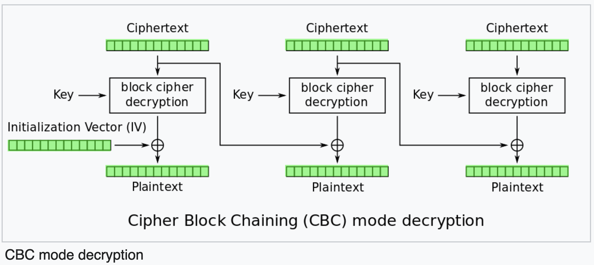

# Write Up haki-tako-game | LineCTF 2024 | crypto

> "Haki" is a power that lies dormant in all the world's creatures... "Presence", "fighting spirit" and "intimidation"... It is not different from the things that humans can naturally sense such as these... 'The act of not doubting'. That is strength!

2 files are given:
- `challenge_server.py`
- `crypto.py`
## Run Server locally:

1. `python3 -m venv venv`
2. `source venv/bin/activate`
3. `pip install pycryptodome` 
4. delete `from server_secret import FLAG, MSG_FORMAT` from `crypto.py` 
5. write `FLAG="local_flag"` in `crypto.py` 
6. `python challenge_server.py`
## Interaction with Server

```
nc localhost 11223

{"nonce": "abd550ea71c0fb4d521cb966", "ct": "e4126a947e2fbb3bf48becebefc15947ee59e4268d3b4fc69ed3216cef54b1302e5d57845705cfd90d397512289da09f865cebe518c566dec67d56f6475448b45da361ed175a3d7e97dbc7008a4474a6854b4dcf585a5e67b500972adc5b81181c16543a0a20cfee139d3876634ec4ddfc82caaf7248d72cef7750842921284b8e2e9c7752d0b231e449237da1efa75b38ded454f076b44d7f81ab1bc7332b7ba1bdfb2fe7b36bcf3a4585e25c4eb05f7c249949f01f45c787759a1eef52681c32642eb87980380e8971aedde95ce1738276a8671480216f4f382a2e5fd559d40bcf87d8973c036cc167defb91838548b031410e210a171543cfe7d11d40f8195a19dd9765e8e1464c5c44d276ec4e4ac7f8a1766baf1944a1d1a211b2f5d9319474ee88e502fca760acad2cf23d72859c3a8474529ef5905879339e8cde76e47d6085cb9b51756b1ee3ca57f8fd6c92", "tag": "6b4a51eef4584616dd6a0830c13de462", "msg": "Send me ciphertext(hex) or pin-code.\nNew encrypted msg..."}
```

The server responds with a 12-byte `Nonce`, a 336-byte `Ciphertext`, a 16-byte `Tag` and a prompt `Send me ciphertext(hex) or pin-code.\nNew encrypted msg...`

Client-Input:
```
test
```
Client-Output:
```
{"msg": "Incorrect pin. Bye.\n"}
```

It is not clear yet what the server expects of us, so let's dive into the code.
## Analysing the Code

challenge_server.py
```python
class ChallengeHandler(BaseRequestHandler):
	def handle(self):
		try:
			...
			new_encrypted_msg, correct_pin, aes_key = generate_new_msg()
		...
		while True:
			...
			req_msg = req.recv(1024).decode().strip()
			...
			req.sendall(json.dumps(new_encrypted_msg).encode('utf-8') + b"\n")
			...
			if len(req_msg) <= 512:
				print(len(req_msg))
				flag = check_pin(req_msg, correct_pin)
				if "" == flag:
				ret = {
					'msg': 'Incorrect pin. Bye.\n'
				}
				req.sendall(json.dumps(ret).encode('utf-8') + b"\n")
				else:
					ret = {
						'flag': flag
					}
					req.sendall(json.dumps(ret).encode('utf-8') + b'\n')
				break # Prevent Brute Force
			...
```

If the client-input, stored in `req_msg`, is shorter than 512 characters, it will be compared with the pin.

The correct pin is generated further up in the code by `generate_new_msg()` along with the `new_encrypted_msg` that appears right after connecting to the server.

### Taking a look at `generate_new_msg()`

```python
def generate_new_msg():
	aes_key = get_random_bytes(32)
	pin = get_random_bytes(256)
	msg = b'Your authentication code is..' + pin + b'. Do not tell anyone and you should keep it secret!'
	return gcm_encrypt(msg, aes_key), pin, aes_key

def gcm_encrypt(plaintext, aes_key):
	...
```

Here, a message `msg` containing the secret `pin` is encrypted via [AES-GCM (Galois-Counter Mode)](https://en.wikipedia.org/wiki/Galois/Counter_Mode).  

In `gcm_encrypt`, the AES-Implementation from `Crypto.Cipher` is used. There is no vulnerability in there.
## An overview of AES-GCM


<span style="color:black; background:lightgreen"> Green </span> => known to the user
<span style="color:black; background:lightcoral"> Red </span> => unknown, goal to find out
<span style="color:black; background:lightgrey"> Grey </span> => unimportant

Both the plaintext and the ciphertext are 336 bytes long.
The AES block size is 16 bytes, thus there will be 21 blocks of data.

The Goal of this challenge will be to find out to what values the counters are being encrypted.
These values can then be xor-ed with the ciphertext to obtain the Plaintext containing the secret pin.
## More Code in `ChallengeHandler.handle(self)`

```python
class ChallengeHandler(BaseRequestHandler):
	def handle(self):
		try:
			...
			new_encrypted_msg, correct_pin, aes_key = generate_new_msg()
			...
			ct_len_in_byte = len(new_encrypted_msg['ct'])//2
			msg_block_len_in_hex = (16*(math.ceil(ct_len_in_byte / 16)))*2
		...
		while True:
			...
			req_msg = req.recv(1024).decode().strip()
			...
			if len(req_msg) <= 512:
				... # Check Pin to get Flag
			elif len(req_msg) <= msg_block_len_in_hex+32:
				ret = truncated_cfb128_decrypt(bytes.fromhex(req_msg), aes_key)
				ret['msg'] = 'CFB Decryption'
				req.sendall(json.dumps(ret).encode('utf-8') + b"\n")
			else:
				ret = cbc_decrypt(bytes.fromhex(req_msg), aes_key)
				ret['msg'] = 'CBC Decryption'
				req.sendall(json.dumps(ret).encode('utf-8') + b'\n')
			...
```

If the user input is longer than 512 bytes and shorter than `msg_block_len_in_hex+32 (=704)`, `truncated_cfb128_decrypt` is called with the input and `aes_key` as parameters.

If the user input is even longer, `cbc_decrypt` is called with the input and `aes_key` as parameters.

> [!CAUTION]  
> The 3 modi are using the same AES-Key.

### Taking a look at `truncated_cfb128_decrypt()`

```python
AES_IV_HEX = "5f885849eadbc8c7bce244f8548a443f"
aes_iv = bytes.fromhex(AES_IV_HEX)

def cfb128_decrypt(ciphertext, aes_key):
	cipher = AES.new(key=aes_key, mode=AES.MODE_CFB, iv=aes_iv, segment_size=128)
	ret = {
		"ret": cipher.decrypt(ciphertext).hex()
	}
	return ret

def truncated_cfb128_decrypt(ciphertext, aes_key):
	ret = cfb128_decrypt(ciphertext, aes_key)
	ret['ret'] = ret['ret'][:len(ret['ret'])-(len(ret['ret'])%32)]
	for i in range(32, len(ret['ret'])+1, 32):
		ret['ret'] = ret['ret'][:i-4] + "0000" + ret['ret'][i:]
	return ret
```

The user input is being decrypted with [AES-CFB (Cipher Feedback Mode)](https://en.wikipedia.org/wiki/Block_cipher_mode_of_operation#Cipher_feedback_(CFB)).
The last two bytes of each plaintext-block is replaced by 0x0000.

> [!CAUTION]  
> Hardcoded IV


<span style="color:black; background:lightgreen"> Green </span> => known to the user
<span style="color:black; background:lightcoral"> Red </span> => unknown, goal to find out
<span style="color:black; background:lightgrey"> Grey </span> => unimportant

#### How does this mode help us?

Even though the function performs a decryption, a "block cipher encryption" block is used (see picture). These are the same blocks that are being used in AES-GCM to encrypt the counters as the same `aes_key` is used.

As we can dictate the input for the encryption-block in AES-CFB, we can use the counter-values of the AES-GCM as inputs in the AES-CFB mode. This gives us 14 out of 16 bytes for each value the counters are encrypted to.

We still need to find out the remaining 2 bytes of each block.

### Taking a look at `cbc_decrypt()`

```python
AES_IV_HEX = "5f885849eadbc8c7bce244f8548a443f"
aes_iv = bytes.fromhex(AES_IV_HEX)

def cbc_decrypt(ciphertext, aes_key):
	cipher = AES.new(key=aes_key, mode=AES.MODE_CBC, iv=aes_iv)
	ret = {
		"ret": cipher.decrypt(ciphertext).hex()
	}
	return ret
```

Normal [AES-CBC (Cipher Block Chaining)](https://en.wikipedia.org/wiki/Block_cipher_mode_of_operation#Cipher_block_chaining_(CBC)) decryption, but again with hardcoded IV. 


<span style="color:black; background:lightgreen"> Green </span> => known to the user
<span style="color:black; background:lightcoral"> Red </span> => unknown, goal to find out
<span style="color:black; background:lightgrey"> Grey </span> => unimportant

#### How does this mode help us?

As we can control the input of the "block cipher decryption"-block and get back the output, we can use this mode to find out the 2 redacted bytes by bruteforcing.

We are creating all 65.536 possible Outputs of the "block cipher encryption"-block for a particular AES-GCM-Counter value and hand them over to the CBC-Decryption.
If the right input is used for the "block cipher decryption"-block, the output will be the AES-GCM Counter value.

> [!NOTE]
> 1000 characters can be used in each request to the server. Thus, each request can contain 31 blocks of 16 bytes.
> Worst case, we need to make `21 * (65536/31) = 44.396` requests.

## Getting the Pin and the flag

After having bruteforced the correct encrypted value of every AES-GCM counter, we can xor them with the ciphertext and get the the message with the secret pin. After entering the pin, the server returns the flag.
## Summary

We can decipher the Ciphertext of AES-GCM by finding out what values the counter-values encrypt to.
The (truncated) CFB-mode helps to reduce the amount of possible values from 2^128 to 2^16 for each counter.
The CBC-Mode is used to bruteforce the correct value.

All of this is possible, because the same AES-Key is being used in the three different modes.
## Lessons learned:

> [!NOTE]
> - If different modi are available, a shared key is a vulnerability.
> - In the Crypto module (pycryptdome), the counter value of AES-GCM (and AES-CTR) starts at 1, not at 0

## Exploit

```
source venv/bin/activate
pip3 install pwntools
python3 exploit.py
```

